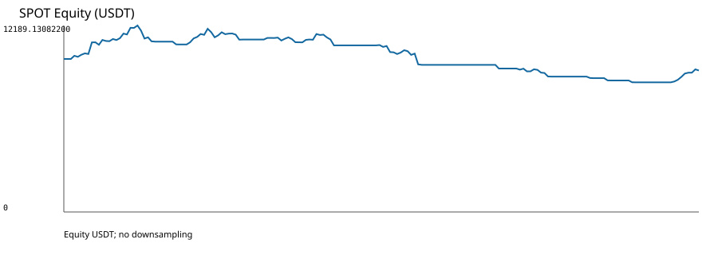
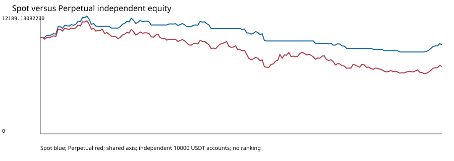

# OWNER_SMOKE_002 Replacement 001 — تقرير Owner

> **هذه ليست توصية تداول، وليست Final Holdout، ولا تسمح بأي Profitability Claim.**

الغرض `EXPLORATORY_OPERATIONAL_VALIDATION` فقط، والنافذة `[2021-01-01T00:00:00Z, 2021-08-01T00:00:00Z)` مع scoring `[2021-02-01T00:00:00Z, 2021-08-01T00:00:00Z)` مصنفة `DATA_QUALITY_INSPECTED_NOT_FINAL_HOLDOUT`.

## الحكم التنفيذي

- Spot: `CHECK_PASS` وdeterministic replay `PASS`؛ 27 Order و27 Fill.
- Perpetual: `CHECK_PASS` وdeterministic replay `PASS`؛ 55 Order و55 Fill.
- لا executable Bar أوMark رُفضت بسبب precision، ولا `No market` منهجي.
- Final Holdout used: `false`؛ Real profitability claim: `false`؛ Research eligibility: `INELIGIBLE`.
- كانت النتيجة المالية سلبية في التجربتين. لم تتغير الاستراتيجية أوparameters أوالنافذة أوالبيانات لجعل النتيجة أفضل.

## Spot

| الحقل | القيمة |
|---|---:|
| Completed Daily Bars | 212 |
| Scored decisions | 181 |
| Orders | 27 |
| Fills | 27 |
| Native positions | 14 |
| Completed native trades | UNDEFINED |
| Long entries | 14 |
| Short entries | 0 |
| Exits | 13 |
| Gross PnL | UNDEFINED |
| Net PnL (USDT) | -751.78721000 |
| Fees (USDT) | 119.59221000 |
| Funding (USDT) | NOT_APPLICABLE |
| Ending equity (USDT) | 9248.21279000 |
| Maximum drawdown | 0.30479815 |
| Sharpe | -2.4124616673999877 |
| Sortino | -4.553253456945881 |
| Calmar | UNDEFINED |
| Win rate (native PnL statistic) | 0.14285714285714285 |
| Profit factor | 0.6371392910652053 |
| Average trade | UNDEFINED |
| Exposure ratio | 0.491708870473 |
| Terminal signed quantity | 0.1 |
| Checker | CHECK_PASS |
| Replay | PASS |

[تقرير Spot المفصل](../spot-report/README.md)

## Perpetual

| الحقل | القيمة |
|---|---:|
| Completed Daily Bars | 212 |
| Scored decisions | 181 |
| Orders | 55 |
| Fills | 55 |
| Native positions | 28 |
| Completed native trades | UNDEFINED |
| Long entries | 14 |
| Short entries | 14 |
| Exits | 27 |
| Gross PnL | UNDEFINED |
| Net PnL (USDT) | -3010.78713375 |
| Fees (USDT) | 242.69077200 |
| Funding (USDT) | -692.06436175 |
| Ending equity (USDT) | 6989.21286625 |
| Maximum drawdown | 0.46862798 |
| Sharpe | -1.0559386792006344 |
| Sortino | -1.415784386437887 |
| Calmar | UNDEFINED |
| Win rate (native PnL statistic) | 0.10714285714285714 |
| Profit factor | 0.8226675270475429 |
| Average trade | UNDEFINED |
| Exposure ratio | 0.994367710252 |
| Terminal signed quantity | 0.1 |
| Checker | CHECK_PASS |
| Replay | PASS |

[تقرير Perpetual المفصل](../perpetual-report/README.md)

## الهوية

| الربط | Spot | Perpetual |
|---|---|---|
| DatasetRelease | `fd8542c109cfbf7d6b19d5b7bbb7705c6a161efc807695f3671978c381e34eca` | `b6c8f5d659f3441c924b613d770342796c90b90a970f42a3dc8227c856198917` |
| Catalog | `db0971d28caba547378e3acba5ad8df1cbd0d6d5be963d153248928a729e374f` | `7c96897a8e1ea3c02198238a277fb8c3d995f54dd90dc381e534a5f21b017ae0` |
| Strategy identity | `36a8da3b30f72b20872d12f1556ee6c2b0776c61a2685a05733094970bd96fca` | `6493e4e80528ea818ba6f0d9f7841d957349cc188576eea97a6d50e3b94492f9` |
| SourceRevision | `e60c41b6533144df9eb6dfe55117cb0f3542978c` | `88c8a38acd0654d3781d8be8b6427af040b71da1` |
| Replay identity | `60a312df85e5bba027306db63ddb007e51f48996fabb168f06cd6209827a6387` | `c02f6b6f0c304dbb6eed9891f43c92c371f40989d3219f6e53b2411e481f4f3a` |

## القيود

- التنفيذ bar-based والرسوم `ESTIMATED_FEE` وفق العقد المقفل؛ لا ادعاء spread أوqueue أوimpact تاريخي.
- لا يوفر runtime المقفل completed-trade sequence أوgross PnL أوCalmar بصورة غير ملتبسة؛ بقيت القيم `UNDEFINED` ولم تُحوّل إلى صفر.
- المركز النهائي مفتوح في التجربتين وفق terminal policy المقفلة.
- [Mechanical Integrity](../mechanical-integrity/README.md) و[Deterministic Replay](../deterministic-replay/README.md) يعرضان البوابات المستقلة.

## الرسوم

