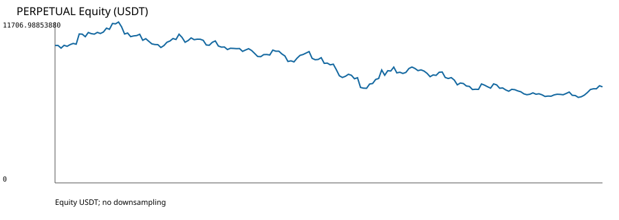
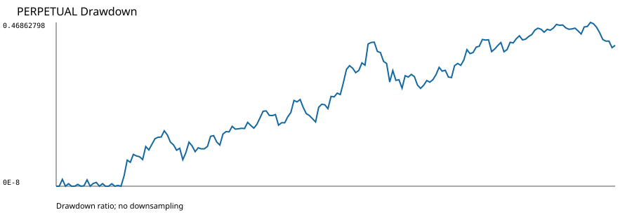
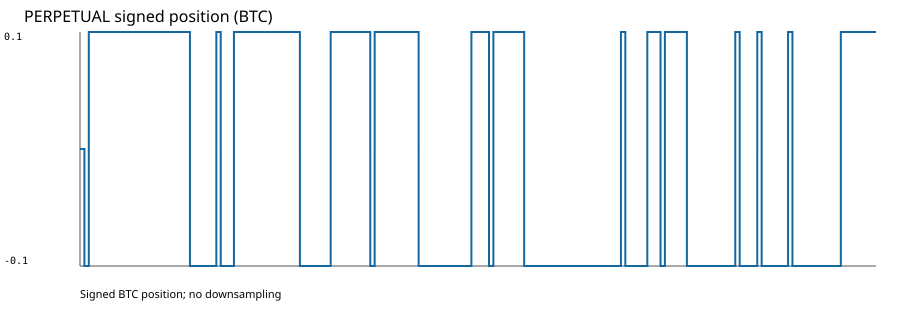
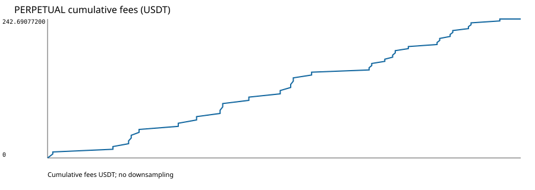
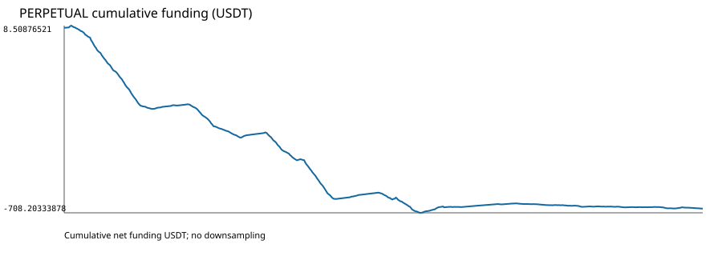

# تقرير Perpetual — OWNER_SMOKE_002 Replacement 001

> **هذه ليست توصية تداول، وليست Final Holdout، ولا تسمح بأي Profitability Claim.**

الغرض `EXPLORATORY_OPERATIONAL_VALIDATION` فقط، والنافذة `[2021-01-01T00:00:00Z, 2021-08-01T00:00:00Z)` مع scoring `[2021-02-01T00:00:00Z, 2021-08-01T00:00:00Z)` مصنفة `DATA_QUALITY_INSPECTED_NOT_FINAL_HOLDOUT`.

| الحقل | القيمة |
|---|---:|
| Completed Daily Bars | 212 |
| Scored decisions | 181 |
| Orders | 55 |
| Fills | 55 |
| Native positions | 28 |
| Completed native trades | UNDEFINED |
| Long entries | 14 |
| Short entries | 14 |
| Exits | 27 |
| Gross PnL | UNDEFINED |
| Net PnL (USDT) | -3010.78713375 |
| Fees (USDT) | 242.69077200 |
| Funding (USDT) | -692.06436175 |
| Ending equity (USDT) | 6989.21286625 |
| Maximum drawdown | 0.46862798 |
| Sharpe | -1.0559386792006344 |
| Sortino | -1.415784386437887 |
| Calmar | UNDEFINED |
| Win rate (native PnL statistic) | 0.10714285714285714 |
| Profit factor | 0.8226675270475429 |
| Average trade | UNDEFINED |
| Exposure ratio | 0.994367710252 |
| Terminal signed quantity | 0.1 |
| Checker | CHECK_PASS |
| Replay | PASS |

## التنفيذ والتمويل

- Profile: `BINANCE_USDM_LINEAR_PERPETUAL_ONE_WAY_NETTING`؛ MARGIN/NETTING، leverage=1، Hedge Mode معطل.
- execution Bars `305280/305280` وMark `305280/305280` قُبلت بلا precision rejection أوmissing market state.
- 55 Order و55 Fill؛ 14 long و14 short entries؛ 27 reversal نُفذت close-to-flat ثم أمرًا مستقلًا بلا direct cross-zero.
- 636 source funding events أنتجت 1,272 runtime updates، لكنها أنتجت 539 settlement مالية أصلية فقط للـ539 boundary ذات position؛ 97 boundary بلا position أنتجت صفر settlement.
- latest causal Mark فقط: age من 0 إلى 46,000,000 ns، تحت الحد 60,000,000,000 ns؛ لا future أوnearest أوinterpolation أوfallback.
- Net PnL الحقيقي `-3010.78713375 USDT`؛ fees `242.69077200 USDT`؛ net funding `-692.06436175 USDT`؛ ending equity `6989.21286625 USDT`.

## الرسوم

DatasetRelease `b6c8f5d659f3441c924b613d770342796c90b90a970f42a3dc8227c856198917`؛ Catalog `7c96897a8e1ea3c02198238a277fb8c3d995f54dd90dc381e534a5f21b017ae0`؛ Strategy `6493e4e80528ea818ba6f0d9f7841d957349cc188576eea97a6d50e3b94492f9`؛ SourceRevision `88c8a38acd0654d3781d8be8b6427af040b71da1`.
