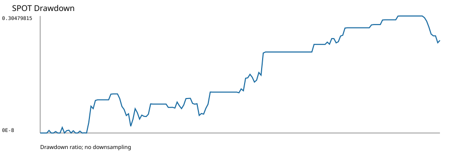
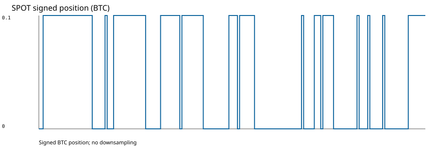
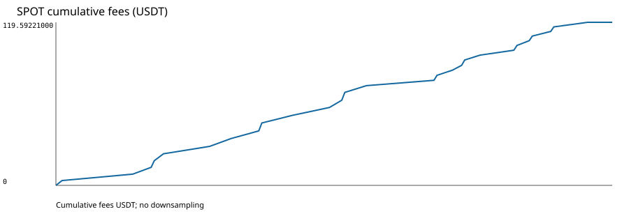

# تقرير Spot — OWNER_SMOKE_002 Replacement 001

> **هذه ليست توصية تداول، وليست Final Holdout، ولا تسمح بأي Profitability Claim.**

الغرض `EXPLORATORY_OPERATIONAL_VALIDATION` فقط، والنافذة `[2021-01-01T00:00:00Z, 2021-08-01T00:00:00Z)` مع scoring `[2021-02-01T00:00:00Z, 2021-08-01T00:00:00Z)` مصنفة `DATA_QUALITY_INSPECTED_NOT_FINAL_HOLDOUT`.

| الحقل | القيمة |
|---|---:|
| Completed Daily Bars | 212 |
| Scored decisions | 181 |
| Orders | 27 |
| Fills | 27 |
| Native positions | 14 |
| Completed native trades | UNDEFINED |
| Long entries | 14 |
| Short entries | 0 |
| Exits | 13 |
| Gross PnL | UNDEFINED |
| Net PnL (USDT) | -751.78721000 |
| Fees (USDT) | 119.59221000 |
| Funding (USDT) | NOT_APPLICABLE |
| Ending equity (USDT) | 9248.21279000 |
| Maximum drawdown | 0.30479815 |
| Sharpe | -2.4124616673999877 |
| Sortino | -4.553253456945881 |
| Calmar | UNDEFINED |
| Win rate (native PnL statistic) | 0.14285714285714285 |
| Profit factor | 0.6371392910652053 |
| Average trade | UNDEFINED |
| Exposure ratio | 0.491708870473 |
| Terminal signed quantity | 0.1 |
| Checker | CHECK_PASS |
| Replay | PASS |

## التنفيذ

- Profile: `BINANCE_SPOT_CASH_LONG_ONLY`؛ CASH/NETTING؛ borrowing وshort وfunding غير مطبقة.
- 304,596/304,596 executable Bars قُبلت؛ precision skips وmissing market state و`No market` = 0.
- كل الـ27 Order وصلت إلى market state سببية وأنتجت 27 Fill أصلية من Nautilus بعد latency 60 ثانية.
- 14 long entries و13 exits؛ لا short entry. المركز النهائي LONG `0.1 BTC`.
- Net PnL الحقيقي `-751.78721000 USDT`، والـfees `119.59221000 USDT`، والـending equity `9248.21279000 USDT`.

## الرسوم

DatasetRelease `fd8542c109cfbf7d6b19d5b7bbb7705c6a161efc807695f3671978c381e34eca`؛ Catalog `db0971d28caba547378e3acba5ad8df1cbd0d6d5be963d153248928a729e374f`؛ Strategy `36a8da3b30f72b20872d12f1556ee6c2b0776c61a2685a05733094970bd96fca`؛ SourceRevision `e60c41b6533144df9eb6dfe55117cb0f3542978c`.
